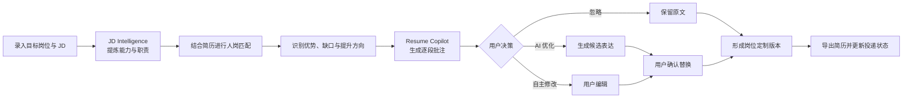
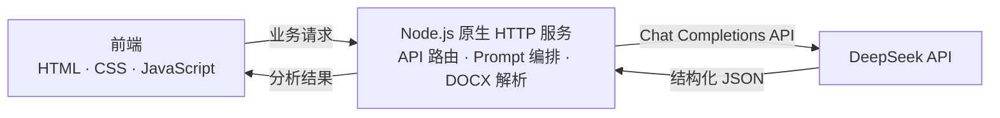

# JobFlow

> 面向校招、实习与早期职业求职者的 AI 求职工作台，让“看懂岗位、判断匹配、优化简历、追踪投递”从分散操作变成一条连续、可执行的求职流程。

**项目阶段：** 可运行 MVP  
**项目角色：** 产品设计 / AI 应用设计 / 原型实现  
**核心关键词：** 求职流程、JD 解析、人岗匹配、简历优化、AI Copilot

---

## 1. 项目简介

### 产品定位

JobFlow 不是一个单点的“AI 改简历工具”，而是以目标岗位为核心的求职工作台。产品将岗位理解、人岗匹配、简历优化和投递管理串联起来，帮助用户围绕每一个目标岗位形成完整的求职行动闭环。

### 目标用户

- 正在进行校招或寻找实习机会的大学生；
- 缺少系统求职方法、难以独立拆解 JD 的早期职业求职者；
- 同时申请多个岗位，需要管理不同岗位、简历版本和投递进度的用户；
- 希望使用 AI 提升准备效率，但仍要求内容真实、可控的求职者。

### 解决的问题

传统求职工具通常只覆盖职位浏览、简历生成或投递记录中的某一个环节。JobFlow 以“岗位”为信息组织单元，将分散的 JD、个人简历、AI 分析结果和投递状态沉淀在同一工作区，降低用户在多个工具之间反复切换和重复整理信息的成本。

产品希望回答三个关键问题：

1. **这个岗位真正需要什么？**
2. **我的优势和差距在哪里？**
3. **下一步应该如何调整简历并推进申请？**

---

## 2. 用户痛点

| 求职阶段 | 传统流程中的问题 | 对用户的影响 |
| --- | --- | --- |
| 岗位筛选 | JD 信息密度高、表达模糊，用户难以区分核心要求与加分项 | 判断岗位是否值得投入的成本高 |
| 人岗判断 | 多依赖主观感受，缺少基于简历证据的匹配分析 | 容易高估匹配度，或因不自信错过机会 |
| 简历准备 | 一份通用简历重复投递，优化建议泛化且难以落到具体文本 | 简历无法针对岗位突出有效经历 |
| AI 使用 | 通用对话容易补造经历、给出空泛建议，结果不可直接使用 | 用户需要二次核实和重写，信任成本高 |
| 投递管理 | 岗位、简历版本和申请状态分散在招聘网站、表格与聊天记录中 | 多岗位并行时容易遗漏，复盘困难 |

由此形成的核心需求不是“再生成一份简历”，而是获得一套围绕目标岗位、能够持续推进的决策与行动支持。

---

## 3. 产品方案

JobFlow 将求职过程拆分为三个彼此衔接的核心模块。

### 3.1 Job Workspace｜岗位工作台

以单个目标岗位为中心，集中管理从岗位分析到投递结果的全过程。

**核心能力：**

- 创建并管理多个目标岗位；
- 聚合岗位 JD、分析结果、简历和历史版本；
- 以“JD 分析 → 简历优化 → 已投递 → 面试 → Offer”展示流程进度；
- 记录待投递、已投递、面试中、已 Offer、未通过等状态变化；
- 保留分析记录和简历版本，支持后续回顾与复盘。

**产品价值：** 将一次求职申请从零散文件和临时操作，转化为有上下文、有进度、有历史的任务工作区。

### 3.2 JD Intelligence｜岗位智能分析

帮助用户从招聘文本中快速提取岗位真正关注的能力，并进一步判断个人匹配情况。

**核心能力：**

- 提炼岗位核心能力、技能关键词和主要职责；
- 使用 P0 / P1 / P2 区分核心要求、重要能力和加分能力；
- 结合用户简历，从能力、经历和技能维度给出匹配判断；
- 将“已匹配优势”和“能力缺口”与真实简历证据对应；
- 基于能力缺口生成下一步竞争力提升方向。

**产品价值：** 把“读 JD”从信息浏览转化为结构化理解，并为后续简历优化提供统一依据。

### 3.3 Resume Copilot｜AI 简历助手

围绕目标岗位审阅用户已有简历，通过逐段批注和人机协作完成岗位定制。

**核心能力：**

- 支持 PDF、DOCX 简历导入和文本解析；
- 基于目标 JD 输出简历评分和逐段批注；
- 区分“经历表达优化”与“岗位匹配优化”；
- 将建议定位到简历原文，支持 AI 优化表达、自主修改或忽略建议；
- 修改内容仅在用户确认后替换原文，避免 AI 自动覆盖；
- 记录不同简历版本，并支持导出岗位定制 PDF。

**产品价值：** AI 不直接代替用户编造一份新简历，而是作为 Copilot 提供可定位、可判断、可确认的修改建议。

---

## 4. AI 能力设计

### DeepSeek API 接入

项目通过后端接入 DeepSeek Chat Completions API。前端只调用 JobFlow 自身的业务接口，API Key 保留在服务端环境变量中，避免在浏览器端暴露。

当前 AI 任务被拆分为独立能力：

- `jd-review`：岗位要求与职责解析；
- `jd-match`：基于 JD 和简历证据进行人岗匹配；
- `jd-directions`：针对能力缺口生成提升方向；
- `resume-review`：生成简历评分与逐段批注；
- `resume-polish`：在用户确认的事实范围内优化具体表达。

未配置 API Key 时，系统可使用模拟响应完成主要流程演示，便于原型评审与交互验证。

### Prompt 设计

Prompt 设计重点不是追求“更像人写”，而是提高结果的稳定性、真实性和可执行性。

| 设计策略 | 具体做法 | 产品目的 |
| --- | --- | --- |
| 任务边界 | 为 JD 解析、人岗匹配、提升方向和简历修改定义不同角色与职责 | 避免不同模块重复输出或越权建议 |
| 结构化输出 | 约束模型返回固定 JSON 字段和枚举值 | 保证结果能够稳定映射到产品界面 |
| 证据约束 | 匹配结论必须来自 JD 与用户简历中的真实信息 | 降低无依据评分和泛化结论 |
| 防止幻觉 | 禁止新增用户未提供的经历、数字、工具和结果 | 保护求职材料真实性 |
| 优先级设计 | 使用 P0 / P1 / P2 表达岗位要求和能力缺口的重要程度 | 帮助用户优先处理高价值问题 |
| 输出控制 | 限制建议数量、文本长度和字段含义 | 降低阅读负担，提升行动效率 |
| Human-in-the-loop | AI 只生成建议，最终替换、忽略和导出由用户确认 | 保留用户控制权并建立信任 |

### AI 辅助流程



这套流程将 AI 放在“理解、判断、建议”的位置，将事实确认和最终决策保留给用户。

---

## 5. 技术架构



### 架构说明

- **前端：** 负责岗位工作台、分析结果展示、简历批注交互和投递状态管理；
- **后端：** 负责环境变量读取、API Key 隔离、Prompt 编排、DeepSeek 请求及 DOCX 解析；
- **AI 服务：** 根据不同业务任务输出结构化结果；
- **文档能力：** 使用 PDF.js 与 pdf-lib 完成 PDF 预览、批注定位和版本导出。

---

## 6. 核心产品决策

1. **以岗位而不是简历为核心对象。** 同一用户面对不同岗位时，需要不同的分析依据、简历版本和流程状态。
2. **先理解岗位，再优化简历。** 先建立结构化岗位认知，避免 AI 在缺少目标的情况下进行通用润色。
3. **建议必须能够定位到原文。** 将抽象意见变成逐段批注，缩短用户从“知道问题”到“完成修改”的路径。
4. **不让 AI 替用户创造经历。** 通过 Prompt 约束与人工确认机制，在优化表达的同时保护内容真实性。
5. **保留过程资产。** 岗位分析、修改记录和简历版本可复用，帮助用户在持续求职中积累方法和经验。

---

## 7. 后续规划

### 近期：完善 MVP 闭环

- 增加岗位批量导入和职位链接解析；
- 完善异常状态、空状态和 AI 结果纠错机制；
- 补充关键行为埋点，验证 JD 分析完成率、批注采纳率和岗位推进率；
- 建立典型 JD 与简历样本集，对 Prompt 输出进行稳定性评测。

### 中期：增强决策与复盘

- 基于多次申请记录生成求职漏斗和阶段转化分析；
- 对比不同岗位的共性能力要求，形成个人能力画像；
- 提供面试准备、面试记录和失败原因复盘；
- 支持简历版本差异对比及岗位版本推荐。

### 长期：形成个人求职智能体

- 从一次性工具升级为持续理解用户经历与职业目标的求职助手；
- 在用户授权的前提下连接招聘平台、日历和邮件，减少重复录入；
- 基于真实反馈持续优化岗位推荐、材料准备和行动优先级。

---

## 8. 本地运行

### 环境要求

- Node.js 18 或更高版本；
- npm；
- Windows PowerShell（仅交互式 DeepSeek 配置与连接测试脚本需要）。

### 安装依赖

```bash
npm install
```

### 配置环境变量

推荐在 Windows PowerShell 中运行交互式配置脚本。脚本会安全读取 API Key，并在项目根目录创建本地 `.env`：

```powershell
npm run setup:deepseek
```

也可以复制模板后手动填写：

```powershell
Copy-Item .env.example .env
```

项目支持以下环境变量：

| 变量 | 是否必需 | 默认值 | 用途 |
| --- | --- | --- | --- |
| `DEEPSEEK_API_KEY` | 真实 AI 模式必需 | 无 | 服务端调用 DeepSeek API 的凭证 |
| `DEEPSEEK_MODEL` | 否 | `deepseek-chat` | DeepSeek 模型名称 |
| `DEEPSEEK_API_URL` | 否 | `https://api.deepseek.com/chat/completions` | DeepSeek Chat Completions 地址 |
| `PORT` | 否 | `5173` | JobFlow 本地服务端口 |

`.env` 仅保留在本地并已被 `.gitignore` 忽略。未配置 `DEEPSEEK_API_KEY` 时，应用会自动使用模拟 AI 响应。

### 启动项目

```bash
npm start
```

默认访问地址为 `http://localhost:5173`；如设置了 `PORT`，请使用对应端口。

服务启动后，可在另一个 PowerShell 终端测试 DeepSeek 连接：

```powershell
npm run test:deepseek
```

---

## 9. 项目说明

JobFlow 当前为个人产品作品与可运行原型，重点验证以下能力：

- 从真实求职场景中识别用户问题并完成需求拆解；
- 将复杂任务组织为连续、可理解的产品流程；
- 将大模型能力转化为结构化、可交互、可控的产品功能；
- 在 AI 效率、内容真实性和用户控制权之间建立平衡。
